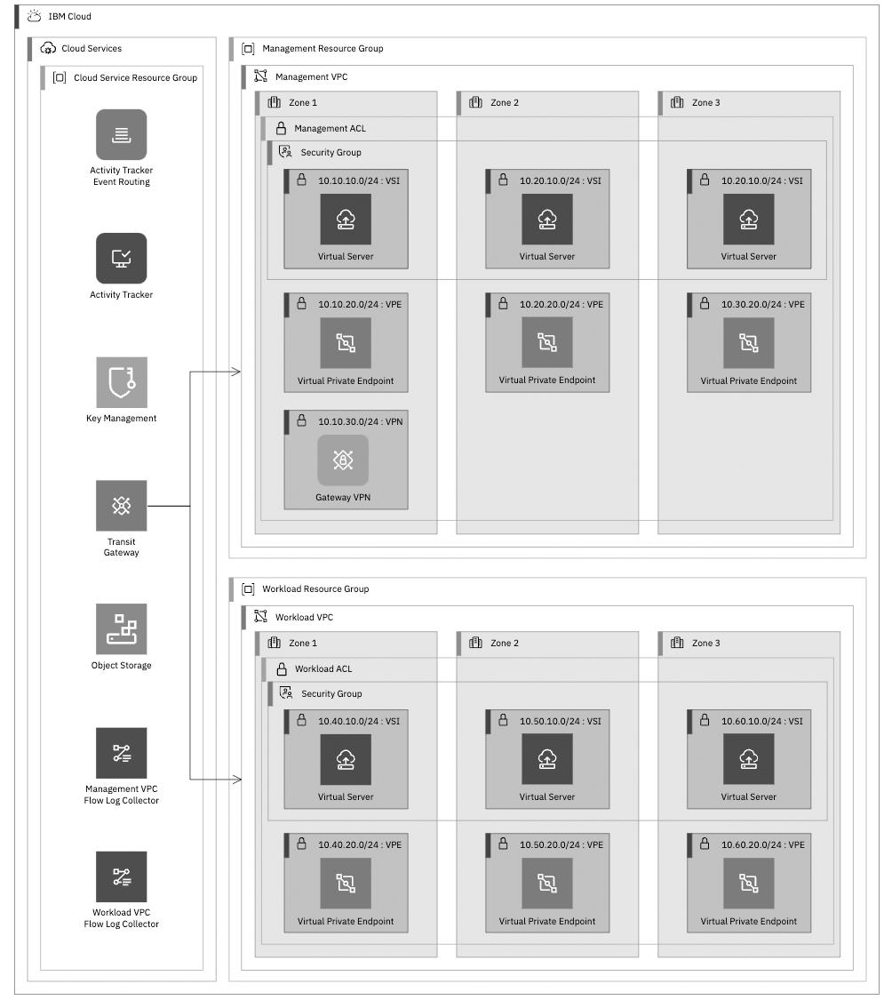

---

copyright:
  years: 2025
lastupdated: "2025-02-05"

keywords:

subcollection: platform-engineering

---

{{site.data.keyword.attribute-definition-list}}

# Concrete Platform Engineering for {{site.data.keyword.cloud_notm}}
{: #white-paper}

Concrete Platform Engineering on {{site.data.keyword.cloud}} streamlines application development by eliminating friction while you enhance scalability, security, and compliance. By leveraging deployable architectures that are built with Terraform and Ansible and {{site.data.keyword.cloud_notm}} catalogs, platform teams can automate infrastructure deployment and empower developers with self-service capabilities. Cost efficiency is achieved through bulk licensing and shared resources, while robust security and regulatory compliance safeguard organizational integrity. A centralized account structure, which is enabled by {{site.data.keyword.cloud_notm}} projects, strengthens governance, making platform engineering a cornerstone of modern IT management.
{: shortdesc}

## Introduction
{: #heading-intro}

Platform engineering is a discipline that is focused on designing and maintaining a cohesive technology platform to support software development and operations teams. Its primary goal is to eliminate friction for application development teams, enabling them to innovate and deliver applications faster and keeping the application secure and compliant.

For more on the general practice of platform engineering and why it is becoming important in the industry, see IBM’s [Platform Engineering](https://www.ibm.com/think/topics/platform-engineering).

## Common friction for application teams
{: #heading-friction}

Application development teams face several challenges that slow down application innovation, development, and delivery—none of which are core to the business problems they aim to solve. These challenges include:

- **Infrastructure Selection:** Choosing the optimal mix of software and services for building applications, storing source code, hosting, scanning for vulnerabilities, and more.
- **Infrastructure Expertise:** Developing or hiring skilled professionals to configure and maintain pipelines, source control systems, networking, clusters, and other infrastructure components.
- **Compliance Programs:** Navigating complex requirements such as PCI, GDPR, and others, which demand expertise, effort to maintain compliance, and resources for managing audits.
- **Security Overhead:** Building or acquiring expertise to ensure application security by hardening images, setting up audits, applying patches, securing network ports, rotating secrets, enforcing secure coding practices, and so on.
- **High Availability:** Ensuring application availability despite outages, software bugs, denial-of-service attacks, and other disruptions requires thoughtful infrastructure design, monitoring, and robust disaster recovery capabilities.
- **Scalability:** Enabling applications to scale with demand requires continuous performance monitoring and a deep understanding of key infrastructure services and potential application bottlenecks.
- **Cost Control:** Managing infrastructure costs through reservations, right-sizing resources, selecting the right service plans, and sharing resources effectively.

A well-designed platform engineering team can alleviate many of these burdens, empowering application teams to focus on innovation and delivery.
However, application teams still need a degree of control to:
-	Move quickly
- Control cost
-	Scale up or down
-	Choose tools that best suit their specific needs

The balance between platform engineering teams that centralize control and application teams that require flexibility highlights the importance of an **Internal Developer Platform (IDP)**. This platform provides an interface that empowers application teams with necessary control and automation, while platform engineers handle foundational infrastructure concerns, ensuring smoother, faster application development.

## Evolution toward an internal developer platform
{: #heading-evolution}

When you establish a platform engineering practice, one of the primary objectives is building automation to streamline the hosting of developer applications. Over time, as developers demand faster response times, greater control, and enhanced visibility, internal platform engineering efforts naturally progress toward creating an Internal Development Platform (IDP)—a self-service ecosystem that empowers developers with intuitive automation and tooling.

{: caption="Crawl-walk platform evolution" caption-side="bottom"}

## Key Steps in platform engineering automation
{: #heading-steps}

Successful platform engineering teams adopt an incremental approach to automation, ensuring early value delivery and continuous improvement. The following are the key steps to achieving effective platform engineering automation:
1. **Application deployment (crawl)**
   Automate workflows to streamline application deployment onto managed infrastructure. The CD pipeline serves as a critical bridge between development and platform engineering, ensuring seamless, reliable, and efficient software releases.
2. **Cloud account setup and hardening (walk)**
   Automate the creation and configuration of cloud accounts with built-in security best practices.
3. **Infrastructure Provisioning (walk)**
   Develop automation for deploying critical hosting infrastructure, including Virtual Private Clouds (VPCs), container clusters, storage solutions, and database services.
4. **Infrastructure and application monitoring (walk)**
   Automate the configuration and access to infrastructure and application monitoring for the platform engineering team
5. **Build and test automation (run)**
   Automate workflows for continuous integration and testing, incorporating unit tests and security and compliance checks.
6. **Application onboarding (run)**
   Automate onboarding tasks for new applications, such as configuring namespaces, setting up pipeline triggers, managing Git repositories, and configuring firewalls.
7. **Application scaling (run)**
   Enable scaling through automation to adjust deployment locations, CPU, storage, networking resources, and database service plans as needed.

## Evolving automation into a self-service IDP
{: #heading-selfserve}

Enhancing automation by exposing key capabilities as self-service features creates a more developer-friendly platform:
1. **Observability Tools for Developers**
   Provide developers with access to observability solutions, enabling monitoring, logging, and alerting for better system insight.
2. **Self-serve Onboarding**
   Allow developers to initiate application onboarding with minimal friction through user-friendly interfaces or APIs.
3. **CI/CD and Observability Integrations**
   Make CI/CD pipelines and observability tools easily accessible for developers to configure, monitor, and troubleshoot their applications independently.
4. **Scaling Automation**
   Provide tooling so that developers can adjust resources and capacity without manual intervention.
By transforming internal platform engineering tools into a robust IDP, organizations can boost developer productivity, reduce operational overhead, and foster innovation through frictionless automation and enhanced autonomy.

## Key Stakeholders and Roles
{: #heading-stakeholders}

Clearly defining roles and responsibilities within platform engineering teams enhances collaboration with stakeholders such as application developers, finance, and compliance. This structured approach improves communication, reduces ambiguity, and ensures accountability.
Roles and Responsibilities:

* Platform engineers
   * Deploy and manage applications and infrastructure.
   * Optimize infrastructure for cost, scalability, security, and compliance.
   * Automate operations to minimize developer friction.
* Application developers
   * Develop, develop, and maintain applications.
   * Use platform engineering’s automation tools for deployment and scaling.
   * Ensure security and compliance within their applications.
* Business and accounting teams
   * Oversee investments in application development.
   * Ensure infrastructure and application cost efficiency.
   * Provide input on scaling decisions and compliance considerations.
* Security and compliance teams
   * Define and enforce security and compliance policies.
   * Provide guidance on infrastructure and application security.
   * Collaborate with other teams to ensure regulatory adherence.

By establishing these clearly defined roles, platform engineering teams can improve workflows, enhance accountability, and align operations with business objectives.

## Reducing friction on {{site.data.keyword.cloud}}
{: #reducing-friction}

### Infrastructure selection
{: #infrastructure-selection}

Businesses rarely gain value from application teams investing in infrastructure innovation. Instead, platform engineering teams should evaluate business needs and provide common infrastructure options. Recognizing that no single solution fits all, they must offer a range of patterns to suit diverse requirements—such as GPUs for AI workloads, specialized storage for data processing, or distinct handling for batch jobs versus long-running services.

Platform engineering teams create **deployable architectures** to deliver standardized infrastructure solutions. These packaged bundles include automation (for example, Terraform, Ansible) and supporting resources like documentation and diagrams. Hosted in a private **{{site.data.keyword.cloud}} catalog**, DAs offer a self-serve menu of options, enabling quick deployment, customization within boundaries, and efficient lifecycle management.

Share IaC as templates (deployable architectures) with the {{site.data.keyword.cloud}} catalog to enable self-serve access and Day 2 operations.
{: tip}

Application development teams can focus on their core responsibilities without needing to become experts on a wide range of infrastructure services. Instead, they simply use the pre-designed deployable architecture solution that is provided by platform engineering teams and adjust parameters as needed to meet their specific requirements. This approach streamlines the deployment process, allowing developers to concentrate on building and delivering high-quality software without being hindered by infrastructure considerations.

For detailed guidance on planning deployable architectures and using private catalogs, see the related [documentation](/docs/secure-enterprise?topic=secure-enterprise-understand-module-da).

{: caption="Deployable architectures in the IBM Cloud catalog" caption-side="bottom"}

{{site.data.keyword.cloud}} offers secure, compliant [deployable architectures](https://cloud.ibm.com/catalog#deployable_architecture_tab) that can be used as-is or customized. These architectures incorporate {{site.data.keyword.cloud}} best practices, developed collaboratively by platform engineering teams and {{site.data.keyword.cloud}} service experts.

{: caption="VPC landing zone deployable architecture example" caption-side="bottom"}

For example, the “Red Hat OpenShift Container Platform on VPC Landing Zone” deployable architecture is ideal for containerized environments. It preconfigures services like logging, auditing, key management, backups, network partitioning, and more. {{site.data.keyword.cloud}} ensures that these architectures stay current, evolving with new features and service updates.

### Infrastructure service expertise
{: #infrastructure-service-expertise}

Selecting and maintaining infrastructure can distract application developers and requires deep expertise and ongoing updates. Platform engineering teams centralize this expertise, eliminating the need for every application team to become experts in tools like pipelines, Git repositories, VPC network access policies, or Kubernetes configuration.

As discussed previously, experts codify their knowledge into **deployable architectures**, ensuring services are correctly configured to meet business needs. This is an ongoing effort, as infrastructure must adapt to evolving security, compliance, service features, and business requirements.

The result is an evolving portfolio of DAs, with which teams must stay current. {{site.data.keyword.cloud}} projects are designed to help users of DAs automate updates in a safe and controlled fashion. {{site.data.keyword.cloud}} projects provide other important benefits.

### Compliance
{: #compliance}

Compliance programs can place a significant burden on application teams, requiring specialized infrastructure expertise and extensive evidence collection. Platform engineering teams help mitigate this challenge by managing infrastructure-related compliance, standardizing evidence formats, and acting as liaisons for auditors. While application teams remain responsible for some tasks, their overall compliance workload is greatly reduced.

Have auditors review each DA as a general tool, not as a specific deployment so future deployments are pre-approved.
{: tip}

To address compliance requirements efficiently, **deployable architectures** incorporate solutions for infrastructure compliance requirements. These DAs can be audited, record compliance in a standardized format, and provide a strong foundation for meeting compliance needs. {{site.data.keyword.cloud}}’s **Security and Compliance Center** enhances this process by automating compliance checks and generating necessary evidence. Furthermore, deployable architectures in the {{site.data.keyword.cloud}} catalog clearly display compliance information, making it easily accessible to application developers and auditors.

**{{site.data.keyword.cloud}} projects** extend further support compliance efforts by:
-	Running additional compliance checks on deployable architecture configurations before deployment.
-	Ensuring deployable architectures remain up to date
-	Detecting configuration changes post-deployment through **drift detection**.

This integrated approach empowers organizations to meet compliance requirements efficiently and enables application teams to focus on their core responsibilities.

### Security
{: #security}

Platform engineering teams on {{site.data.keyword.cloud}} codify security best practices into **Deployable Architectures** while using **enterprise accounts** to enhance security by separating different functions into different accounts.

{: caption="Manage workload accounts from a central administrative account" caption-side="bottom"}

- **Administration account:** Application and platform engineering teams access a centralized administration account for self-serve deployment of deployable architectures and for running automated maintenance operations. The administration account contains the private catalogs of deployable architectures for both teams to self-serve from.

Authorize the projects in the administrative account to deploy and update resources in the workload accounts with trusted profiles that are bound to the project or API keys that are stored in secrets manager where the user doesn’t have access, but the project does.
{: tip}

Workload Accounts
:    Infrastructure and services that support application workloads are deployed into separate workload accounts, simplifying access control and adding an extra layer of security. Access to workload accounts is strictly controlled and typically read only as modifications are done with automation that is controlled from the administrative account.

Production and nonproduction accounts
:    Workload accounts are further broken up into production accounts and nonproduction accounts. Development, test, and staging workloads run in nonproduction accounts. This separation makes it simple to apply additional controls to production accounts – such as controls that protect customer data from employee access as required by GDPR.

User access to workload accounts is restricted through access groups or trusted profiles, granting permissions only for specific tasks, such as accessing observability tools. Infrastructure changes and maintenance activities, including secret rotation and manual backups, are fully automated and run with the administration account. To empower application developers, a curated subset of those automated operations is available for self-service. In rare "break glass" scenarios, select platform engineers can temporarily elevate their privileges through trusted profiles—a controlled, auditable process that is designed to minimize the risk of human error.

Set a short session limit on superuser trusted profiles so that users don’t simply use them all the time.
{: tip}

By packaging these automated operations into DAs and managing them with **{{site.data.keyword.cloud}} projects**, platform engineers ensure consistency, security, and ease of use across all operations. This structured approach minimizes risk and empowers teams with reliable and secure infrastructure management.

In large enterprises, many administration accounts and their associated workload accounts can exist to align with organizational structures. These sets of related accounts can be organized within a single {{site.data.keyword.cloud}} enterprise as **account groups**.

### High availability and scalability
{: #ha-scalability}

Centralized platform engineering expertise ensures that infrastructure enables high availability and scalability. Platform engineers codify their expertise in availability and scaling best practices into **deployable architectures**. When cost or resource limitations are a factor deployable architectures flavors or deployable architecture configuration options (inputs) are provided, allowing application teams to manage tradeoffs between cost, scale, and availability.

{{site.data.keyword.cloud}} best practices for ensuring reliable scaling and availability include:
* **Backup storage:** Store backups in a geographically separate region from the workload they support. {{site.data.keyword.cloud}} offers 9 multi-zone regions globally, along with additional data centers and an expanding number of single-campus Multi-Zone Regions (MZRs).
* **Regular backups:** Implement frequent, automated backups of all critical data to facilitate system recovery. **{{site.data.keyword.cloud}} Databases**, **Block Storage**, and other data services offer automatic backup capabilities making this easy.
* **Backup monitoring and testing:** Continuously monitor backups and regularly test recovery procedures to ensure they work effectively when needed.
* **Backup security:** Safeguard backup data by using IBM **Key Protect** to encrypt backups with your own encryption keys, ensuring confidentiality, integrity, and availability.
* **Contingency planning:** Create contingency plans that include validation procedures for confirming the successful recovery and restoration of the original system configuration.
* **Horizontal scaling:** Use compute services like {{site.data.keyword.cloud}} **VPC virtual machines**, **ROKS/Kubernetes**, or {{site.data.keyword.cloud}} **Code Engine** and adjust the number of nodes or use autoscaling to achieve horizontal application scaling.
* **Vertical Scaling:** Increase the size of nodes in {{site.data.keyword.cloud}} **Clusters**, **virtual machines**, or **Databases** to scale applications vertically.
* **Multi-region deployments:** Enhance both scale and availability by deploying workloads across multiple regions and use IBM **Cloud Internet Services** to globally load balance across regions.

By integrating these practices into deployable architectures, platform engineers ensure that application teams can easily access reliable and scalable infrastructure solutions that are tailored to their needs.

### Controlling Cost
{: #controlling-cost}

Platform engineering teams help control cost for an organization in several ways:
* **Bulk licensing / commitments** – by purchasing services at higher capacity or for more instances or by making commitments for a set of applications rather than a single application at a time, lower costs can be obtained. {{site.data.keyword.cloud}} offers several commitment-based savings mechanisms:
   * **Enterprise savings plan** that provides discounts in return for larger spend commitments across {{site.data.keyword.cloud}},
   * **Reservations** that provide discounts in return for 1-or-3 year terms on compute infrastructure, and
   * **Subscriptions** that give discounts in return for spend commitments across a bundle of services or all of {{site.data.keyword.cloud}}.
    {{site.data.keyword.cloud}} services frequently offer service plans that decrease in cost with higher use or for commitment to higher use.
* **Shared infrastructure** - multiple applications can share the same infrastructure to save costs. This is valuable with services that have a fixed minimum cost like many of the {{site.data.keyword.cloud}} Security services, network, and compute services. Shared infrastructure also allows applications teams to benefit from plans that offer lower per-unit rates at higher consumption levels. Platform engineers are responsible for deploying the shared infrastructure while application teams are onboard with a deployable Architecture.
* **Optimized scaling and monitoring** - platform engineering teams monitor infrastructure use and scale it on behalf of applications for maximum cost efficiency.  IBM Cloudability helps monitor cost and optimize both scale and commitments. An instance of the Cloudability deployable architecture deployed to each workload account makes it easy to monitor cost. In addition, IBM Turbonomic provides automation to optimize resource allocation and AI-powered recommendations.
* **Chargebacks or showbacks** allow costs to be attributed to specific applications. Assisted by {{site.data.keyword.cloud}} projects and cloudability, platform engineering teams can view costs by project and application and thus implement chargebacks or showbacks to create application incentives to control infrastructure spend.

## Conclusion
{: #heading-conclusion}

In response to the cost and complexities of modern infrastructure management, platform engineering is emerging as a strategic approach favored by development organizations. This practice leads to implementation of an internal developer platform (IDP), which can be enhanced with {{site.data.keyword.cloud}} capabilities.

For example, by leveraging deployable architectures, platform engineering teams use templated automation solutions, using tools like Terraform and Ansible. These deployable architectures are then hosted on a private {{site.data.keyword.cloud}} catalog, providing a self-serve interface for quick deployment and customization within predefined guardrails defined by the author. By deploying deployable architectures through projects and adopting an account structure with administrative accounts and workload accounts, many maintenance, security, and compliance concerns can be addressed.

This approach not only reduces operational costs but also enhances security and compliance standards, thereby supporting application teams in their quest to maintain efficiency and effectiveness in complex environments.
