---

copyright:
  years: 2025
lastupdated: "2025-02-14"

keywords:

subcollection: platform-engineering

---

{{site.data.keyword.attribute-definition-list}}

# Concrete Platform Engineering for {{site.data.keyword.cloud_notm}}
{: #white-paper}

Concrete Platform Engineering on {{site.data.keyword.cloud}} streamlines application development by eliminating friction while enhancing scalability, security, and compliance. By leveraging deployable architectures, {{site.data.keyword.cloud_notm}} catalogs, and {{site.data.keyword.cloud_notm}} projects platform teams can automate infrastructure deployment and provide developers with self-service capabilities. Cost efficiency is achieved through bulk licensing and shared resources, while robust security and regulatory compliance safeguard organizational integrity.
{: shortdesc}

{: caption="Concrete platform engineering" caption-side="bottom"}

## Introduction
{: #heading-intro}

Platform engineering is a discipline that is focused on designing and maintaining a cohesive technology platform to support software development and operations teams. Its primary goal is to eliminate friction for application development teams, enabling them to innovate and deliver applications faster while remaining secure and compliant.

For more on the general practice of platform engineering and why it is becoming important in the industry, see IBM’s [Platform Engineering](https://www.ibm.com/think/topics/platform-engineering).

## Common friction for application teams
{: #heading-friction}

Application development teams face several challenges that slow down application innovation, development, and delivery—none of which are core to the business problems they aim to solve. These challenges include:

- **Infrastructure Selection:** Choosing the optimal mix of software and services for building applications, storing source code, hosting, scanning for vulnerabilities, and more.
- **Infrastructure Expertise:** Developing or hiring skilled professionals to configure and maintain pipelines, source control systems, networking, clusters, and other infrastructure components.
- **Application Lifecycle and Shift Left:** Choosing the right set of tools to build, test, and deploy applications. This includes shift left activities like code scanning, code coverage, change management, and evidence collection.
- **Compliance Programs:** Navigating complex requirements such as PCI, GDPR, and others, which demand expertise, effort to maintain compliance, and resources for managing audits.
- **Security Overhead:** Building or acquiring expertise to ensure application security by hardening images, setting up audits, applying patches, scanning for vulnerabilities, securing network ports, rotating secrets, enforcing secure coding practices, and so on.
- **High Availability:** Ensuring application availability despite outages, software bugs, denial-of-service attacks, and other disruptions requires thoughtful infrastructure design, monitoring, and robust disaster recovery capabilities.
- **Scalability:** Enabling applications to scale with demand requires continuous performance monitoring and a deep understanding of key infrastructure services and potential application bottlenecks.
- **Cost Control:** Managing infrastructure costs through reservations, right-sizing resources, selecting the right service plans, and sharing resources effectively.

A well-designed platform engineering team can alleviate many of these burdens, empowering application teams to focus on innovation and delivery.
However, application teams still need a degree of control to:
- Move quickly
- Control cost
- Scale up or down
- Choose tools that best suit their specific needs
- Observe application and infrastructure

The balance between platform engineering teams that need centralized control and application teams that require flexibility highlights the importance of an **Internal Developer Platform (IDP)**. This platform provides an interface that empowers application teams with necessary control and automation, while platform engineers handle foundational infrastructure concerns, ensuring smoother, faster application development.

## Evolution toward an internal developer platform
{: #heading-evolution}

When you establish a platform engineering practice, one of the primary objectives is building automation to streamline the hosting of developer applications. Over time, as developers demand faster response times, greater control, and enhanced visibility, internal platform engineering efforts naturally progress toward creating an Internal Development Platform (IDP)—a self-service ecosystem that empowers developers with intuitive automation and tooling.

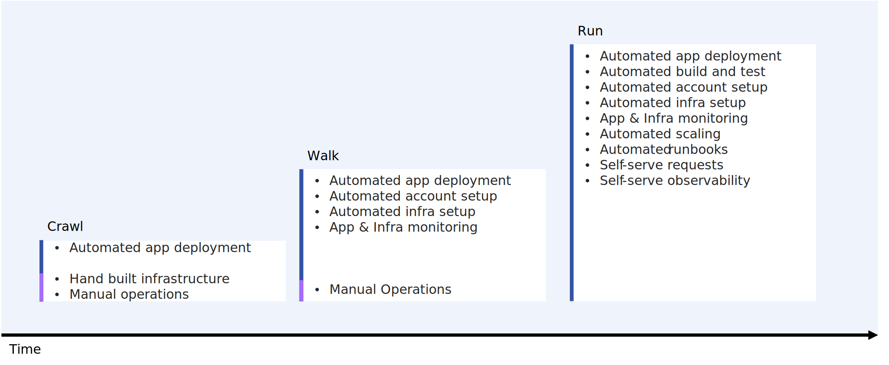{: caption="Crawl-walk platform evolution" caption-side="bottom"}

## Key steps in platform engineering automation
{: #heading-steps}

Successful platform engineering teams adopt an incremental approach to automation, ensuring early value delivery and continuous improvement. The following are the key steps to achieving effective platform engineering automation:
1. **Application deployment (crawl)**
   Automate workflows to streamline application deployment onto managed infrastructure. The CD pipeline serves as a critical bridge between development and platform engineering, ensuring seamless, reliable, and efficient software releases.
2. **Cloud account setup and hardening (walk)**
   Automate the creation and configuration of cloud accounts with built-in security best practices.
3. **Infrastructure Provisioning (walk)**
   Develop automation for deploying critical hosting infrastructure, including Virtual Private Clouds (VPCs), container clusters, storage solutions, and database services.
4. **Infrastructure and application monitoring (walk)**
   Automate the configuration and access to infrastructure and application monitoring for the platform engineering team
5. **Build and test automation (run)**
   Automate workflows for continuous integration and testing, incorporating unit tests and security and compliance checks.
6. **Application onboarding (run)**
   Automate onboarding tasks for new applications, such as configuring namespaces, setting up pipeline triggers, managing Git repositories, and configuring firewalls.
7. **Application scaling (run)**
   Enable scaling through automation to adjust deployment locations, CPU, storage, networking resources, and database service plans as needed.
8. **Shift left (run)**
   Enable application teams to ensure quality, security, compliance, and other key dimensions through shift-left scans, tests, and evidence collection that operate as early as possible in the code-build-test-deploy cycle.

## Evolving automation into a self-service IDP
{: #heading-selfserve}

Enhancing automation by exposing key capabilities as self-service features creates a more developer-friendly platform:
1. **Observability Tools for Developers**
   Provide developers with access to observability solutions, enabling monitoring, logging, and alerting for better system insight.
2. **Self-serve Onboarding**
   Allow developers to initiate application onboarding with minimal friction through user-friendly interfaces or APIs.
3. **CI/CD and Observability Integrations**
   Make CI/CD pipelines (including shift-left) and observability tools easily accessible for developers to configure, monitor, and troubleshoot their applications independently.
4. **Scaling Automation**
   Provide tooling so that developers can adjust resources and capacity without manual intervention.

By transforming internal platform engineering tools into a robust IDP, organizations can boost developer productivity, reduce operational overhead, and foster innovation through frictionless automation and enhanced autonomy.

## Key Stakeholders and Roles
{: #heading-stakeholders}

Clearly defining roles and responsibilities within platform engineering teams enhances collaboration with stakeholders such as application developers, finance, and compliance. This structured approach improves communication, reduces ambiguity, and ensures accountability.
Roles and Responsibilities:

* Platform engineers
   * Deploy and manage applications and infrastructure.
   * Optimize infrastructure for cost, scalability, security, and compliance.
   * Automate operations to minimize developer friction.
   * Operate infrastructure, handle patching, monitor infra KPIs
   * First responders for emergencies
   * Front security and compliance audits
* Application developers
   * Develop, develop, and maintain applications.
   * Use platform engineering automation tools for deployment and scaling.
   * Ensure security and compliance within their applications (leveraging shift-left automation where possible).
   * Monitor application KPIs
* Business and accounting teams
   * Oversee investments in application development.
   * Ensure infrastructure and application cost efficiency.
   * Provide input on scaling decisions and compliance considerations.
   * Monitor business KPIs
* Security and compliance teams
   * Define and enforce security and compliance policies.
   * Provide guidance on infrastructure and application security.
   * Collaborate with other teams to ensure regulatory adherence.

By establishing these clearly defined roles, platform engineering teams can improve workflows, enhance accountability, and align operations with business objectives.

## Reducing friction on {{site.data.keyword.cloud}}
{: #reducing-friction}

### Infrastructure selection
{: #infrastructure-selection}

Businesses rarely gain value from application teams investing in infrastructure innovation. Instead, platform engineering teams should evaluate business needs and provide common infrastructure options. Recognizing that no single solution fits all, they must offer a range of patterns to suit diverse requirements—such as GPUs for AI workloads, specialized storage for data processing, or distinct handling for batch jobs versus long-running services.

Platform engineering teams create **deployable architectures** to deliver standardized infrastructure solutions. These packaged bundles include automation (for example, Terraform, Ansible) and supporting resources that include documentation, architecture diagrams, runbooks, required access permissions, and compliance statements. Hosted in a private **{{site.data.keyword.cloud}} catalog**, DAs offer a self-serve menu of options, enabling quick deployment, customization within boundaries, and efficient lifecycle management.

Share IaC as templates (deployable architectures) with the {{site.data.keyword.cloud}} catalog to enable self-serve access and Day 2 operations.
{: tip}

Application development teams can focus on their core responsibilities without needing to become experts on a wide range of infrastructure services. Instead, they simply use the pre-designed deployable architecture solution that is provided by platform engineering teams and adjust parameters as needed to meet their specific requirements. This approach streamlines the deployment process, allowing developers to concentrate on building and delivering high-quality software without being hindered by infrastructure considerations.

For detailed guidance on planning deployable architectures and using private catalogs, see the related [documentation](/docs/secure-enterprise?topic=secure-enterprise-understand-module-da).

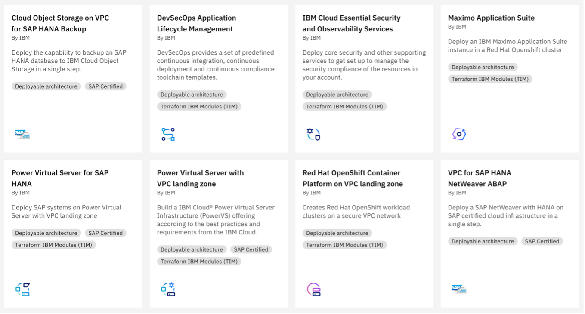{: caption="Deployable architectures in the IBM Cloud catalog" caption-side="bottom"}

{{site.data.keyword.cloud}} offers secure, compliant [deployable architectures](https://cloud.ibm.com/catalog#deployable_architecture_tab) that can be used as-is or customized. These architectures incorporate {{site.data.keyword.cloud}} best practices, developed collaboratively by platform engineering teams and {{site.data.keyword.cloud}} service experts.

Whether the platform engineering team chooses to customize an existing deployable architecture or build an entirely new one, they can leverage {{site.data.keyword.cloud}}'s library of vetted [terraform modules](/catalog?catalog=2) and [best practices](/docs-draft/terraform-on-ibm-cloud?topic=terraform-on-ibm-cloud-white-paper).

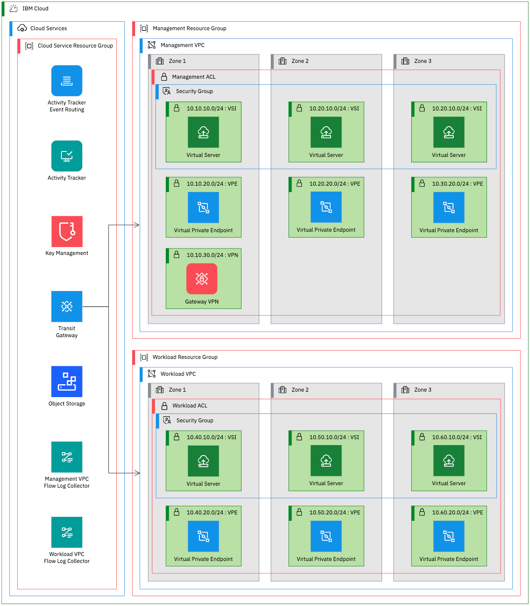 {: caption="VPC landing zone deployable architecture example" caption-side="bottom"}

For example, the “Red Hat OpenShift Container Platform on VPC Landing Zone” deployable architecture is ideal for containerized environments. It preconfigures services like logging, auditing, key management, backups, network partitioning, and more. {{site.data.keyword.cloud}} ensures that these architectures stay current, evolving with new features and service updates.

### Infrastructure service expertise
{: #infrastructure-service-expertise}

Selecting and maintaining infrastructure can distract application developers and requires deep expertise and ongoing updates. Platform engineering teams centralize this expertise, eliminating the need for every application team to become experts in tools like pipelines, Git repositories, VPC network access policies, or Kubernetes configuration.

As discussed previously, experts codify their knowledge into **deployable architectures**, ensuring services are correctly configured to meet business needs. This is an ongoing effort, as infrastructure must adapt to evolving security, compliance, service features, and business requirements.

The result is an evolving portfolio of deployable architectures, with which teams must stay current. {{site.data.keyword.cloud}} projects are designed to help users of deployable architectures automate updates in a safe and controlled fashion.

### Application lifecycle and shift left
{: #application-lifecycle}

A core responsibility of platform engineering is to ensure that applications are deployed safely, reliably, and in alignment with organizational needs. This includes supporting incremental deployments, blue-green switching, rollbacks, and other essential deployment strategies. Additionally, security and compliance requirements introduce complexities such as change management, secrets management, and provenance tracking.

Beyond deployment, development teams require robust tooling for building and testing applications. Over time, these foundational needs expand to include "shift left" practices like code scanning, license compliance, and test coverage analysis—integrating security and quality checks earlier in the development lifecycle.

To streamline these processes, platform engineering teams should provide a comprehensive, pre-packaged solution that allows developers to focus on delivering business value. The {{site.data.keyword.cloud_notm}} [DevSecOps Application Lifecycle Management](https://cloud.ibm.com/catalog/architecture/deploy-arch-ibm-devsecops-alm-e1c16cac-7ea8-413f-a819-67e3a3251e44-global) Deployable Architecture offers a solid foundation for achieving this goal.

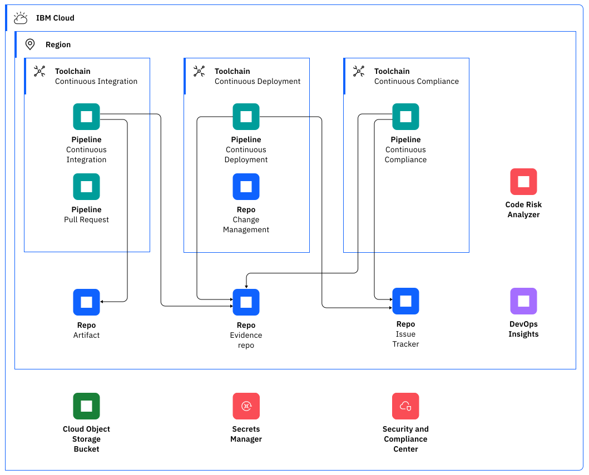{: caption="DevSecOps application lifecycle management deployable architecture" caption-side="bottom"}

### Compliance
{: #compliance}

Compliance programs can place a significant burden on application teams, requiring specialized infrastructure expertise and extensive evidence collection. Platform engineering teams help mitigate this challenge by managing infrastructure-related compliance requirements, standardizing evidence formats, and acting as liaisons for auditors. While application teams remain responsible for some tasks, their overall compliance workload is greatly reduced.

Have auditors review each deployable architecture as a general tool, not as a specific deployment so future deployments are pre-approved.
{: tip}

To address compliance requirements efficiently, **deployable architectures** incorporate solutions for infrastructure compliance requirements. These DAs can be audited, record compliance in a standardized format, and provide a strong foundation for meeting compliance needs. {{site.data.keyword.cloud}}’s **Security and Compliance Center** enhances this process by automating compliance checks and generating necessary evidence. Furthermore, deployable architectures in the {{site.data.keyword.cloud}} catalog clearly display compliance information, making it easily accessible to application developers and auditors.

**{{site.data.keyword.cloud}} projects** extend further support compliance efforts by:
-	Running additional compliance checks on deployable architecture configurations before deployment.
-	Ensuring deployable architectures remain up to date
-	Detecting configuration changes post-deployment through **drift detection**.

This integrated approach empowers organizations to meet compliance requirements efficiently and enables application teams to focus on their core responsibilities.

### Security
{: #security}

Platform engineering teams on {{site.data.keyword.cloud}} codify security best practices into **Deployable Architectures** while using **enterprise accounts** to enhance security by separating different functions into different accounts.

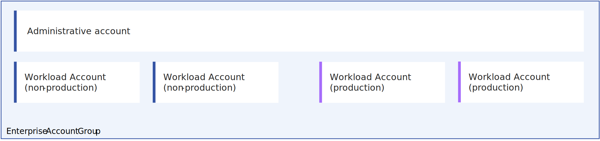{: caption="Manage workload accounts from a central administrative account" caption-side="bottom"}

Administration account
:    Application and platform engineering teams access a centralized administration account for self-serve deployment of deployable architectures and for running automated maintenance operations. The administration account contains the private catalogs of deployable architectures for both teams to self-serve from.

Authorize the projects in the administrative account to deploy and update resources in the workload accounts with trusted profiles that are bound to the project or API keys that are stored in secrets manager where the user doesn’t have access, but the project does.
{: tip}

Workload Accounts
:    Infrastructure and services that support application workloads are deployed into separate workload accounts, simplifying access control and adding an extra layer of security. Access to workload accounts is strictly controlled and typically read only as modifications are done with automation that is controlled from the administrative account.

Production and nonproduction accounts
:    Workload accounts are further broken up into production accounts and nonproduction accounts. Development, test, and staging workloads run in nonproduction accounts. This separation makes it simple to apply additional controls to production accounts – such as controls that protect customer data from employee access as required by GDPR.

User access to workload accounts is restricted through access groups or trusted profiles, granting permissions only for specific tasks, such as accessing observability tools. Infrastructure changes and maintenance activities, including secret rotation and manual backups, are fully automated and executed from the administration account. To empower application developers, a curated subset of those automated operations is available for self-service. In rare "break glass" scenarios, select platform engineers can temporarily elevate their privileges through trusted profiles—a controlled, auditable process that is designed to minimize the risk of human error.

Set a short session limit on superuser trusted profiles so that users don’t simply use them all the time.
{: tip}

By packaging these automated operations into deployable architectures and managing them with **{{site.data.keyword.cloud}} projects**, platform engineers ensure consistency, security, and ease of use across all operations. This structured approach minimizes risk and empowers teams with reliable and secure infrastructure management.

In large enterprises, many administration accounts and their associated workload accounts can exist to align with organizational structures. These sets of related accounts can be organized within a single {{site.data.keyword.cloud}} enterprise as **account groups**.

### High availability and scalability
{: #ha-scalability}

Centralized platform engineering expertise ensures that infrastructure enables high availability and scalability. Platform engineers codify their expertise in availability and scaling best practices into **deployable architectures**. When cost or resource limitations are a factor deployable architectures flavors or deployable architecture configuration options (inputs) are provided, allowing application teams to manage tradeoffs between cost, scale, and availability.

{{site.data.keyword.cloud}} best practices for ensuring reliable scaling and availability include:
* **Backup storage:** Store backups in a geographically separate region from the workload they support. {{site.data.keyword.cloud}} offers 9 multi-zone regions globally, along with additional data centers and an expanding number of single-campus Multi-Zone Regions (MZRs).
* **Regular backups:** Implement frequent, automated backups of all critical data to facilitate system recovery. **{{site.data.keyword.cloud}} Databases**, **Block Storage**, and other data services offer automatic backup capabilities making this easy.
* **Backup monitoring and testing:** Continuously monitor backups and regularly test recovery procedures to ensure they work effectively when needed.
* **Backup security:** Safeguard backup data by using IBM **Key Protect** to encrypt backups with your own encryption keys, ensuring confidentiality, integrity, and availability.
* **Contingency planning:** Create contingency plans that include validation procedures for confirming the successful recovery and restoration of the original system configuration.
* **Horizontal scaling:** Use compute services like {{site.data.keyword.cloud}} **VPC virtual machines**, **ROKS/Kubernetes**, or {{site.data.keyword.cloud}} **Code Engine** and adjust the number of nodes or use autoscaling to achieve horizontal application scaling.
* **Vertical Scaling:** Increase the size of nodes in {{site.data.keyword.cloud}} **Clusters**, **virtual machines**, or **Databases** to scale applications vertically.
* **Multi-region deployments:** Enhance both scale and availability by deploying workloads across multiple regions and use IBM **Cloud Internet Services** to globally load balance across regions.
* **Observability:** Monitor logs and metrics with **IBM Cloud Logs** and **IBM Cloud Monitoring**. Provide access to these essential tools to application teams as part of onboarding.
* **Notifications:** Route alerts and other notifications to the appropriate platform and application operations teams with **IBM Cloud Event Notifications**. Event Notifications integrates with other systems like slack, service now, pager duty making it easy to reach the right people.

By integrating these practices into deployable architectures, platform engineers ensure that application teams can easily access reliable and scalable infrastructure solutions that are tailored to their needs.

### Controlling Cost
{: #controlling-cost}

Platform engineering teams help control cost for an organization in several ways:
* **Bulk licensing / commitments** – by purchasing services at higher capacity or for more instances or by making commitments for a set of applications rather than a single application at a time, lower costs can be obtained. {{site.data.keyword.cloud}} offers several commitment-based savings mechanisms:
   * **Enterprise savings plan** that provides discounts in return for larger spend commitments across {{site.data.keyword.cloud}},
   * **Reservations** that provide discounts in return for 1-or-3 year terms on compute infrastructure, and
   * **Subscriptions** that give discounts in return for spend commitments across a bundle of services or all of {{site.data.keyword.cloud}}.
    {{site.data.keyword.cloud}} services frequently offer service plans that decrease in cost with higher use or for commitment to higher use.
* **Shared infrastructure** - multiple applications can share the same infrastructure to save costs. This is valuable with services that have a fixed minimum cost like many of the {{site.data.keyword.cloud}} Security services, network, and compute services. Shared infrastructure also allows applications teams to benefit from plans that offer lower per-unit rates at higher consumption levels. Platform engineers are responsible for deploying the shared infrastructure while application teams onboard to the infrastructure with a deployable architecture.
* **Optimized scaling and monitoring** - platform engineering teams monitor infrastructure use and scale it on behalf of applications for maximum cost efficiency.  IBM Cloudability helps monitor cost and optimize both scale and commitments. An instance of the Cloudability deployable architecture deployed to each workload account makes it easy to monitor cost. In addition, IBM Turbonomic provides automation to optimize resource allocation and AI-powered recommendations.
* **Chargebacks or showbacks** allow costs to be attributed to specific applications. Assisted by {{site.data.keyword.cloud}} projects and IBM Cloudability, platform engineering teams can view costs by project and application and thus implement chargebacks or showbacks to create application incentives to control infrastructure spend.

## Example IDP built on {{site.data.keyword.cloud_notm}}
{: #idp}

By implementing these best practices, a platform engineering team can construct a robust **Internal Developer Platform (IDP)** on {{site.data.keyword.cloud_notm}}, streamlining the developer experience and operational efficiency.

### Application developer view
{: #idp-app-dev-view}

An IBM Cloud-based IDP empowers application development teams with a self-service menu of templates for various application types. These templates come with preconfigured CI/CD pipelines and automated deployment capabilities, enabling developers to manage their deployments efficiently.

Developers gain full visibility into their applications' deployment status, logs, and monitoring across both nonproduction and production environments. They also have direct access to database and storage services in nonproduction environments, streamlining debugging and issue resolution.

Beyond deployment and monitoring, developers receive automated notifications for key events via their preferred messaging platform. They can also track costs, apply updates, and report platform issues seamlessly—ensuring an efficient and productive development workflow.

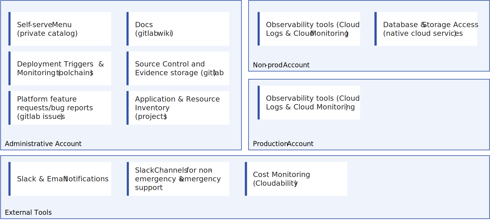{: caption="Application developer experience" caption-side="bottom"}

To interact with the IDP, application development teams log in to the IBM Cloud administrative account, where they can:

- Browse their templates (**deployable architectures**) through an IBM Cloud **private catalog** tailored to their needs.
- Access an inventory of existing applications with **IBM Cloud projects**.
- Manage deployments through the **IBM Cloud toolchains** interface.
- Monitor and observe applications with **IBM Cloud observability** across nonproduction and production environments.

For those seeking a streamlined experience, IAM policies, account settings, and catalog configurations can restrict access to unnecessary cloud complexities, allowing developers to focus on building and deploying applications efficiently.

### Application developer view with Backstage / Red Hat Developer Hub
{: #idp-backstage}

All the {{site.data.keyword.cloud_notm}} tools and services are accessible via CLI and API, allowing seamless integration with other platforms. This section explores how an IDP can be built using **Backstage.io** or **Red Hat Developer Hub** while leveraging {{site.data.keyword.cloud_notm}} services.

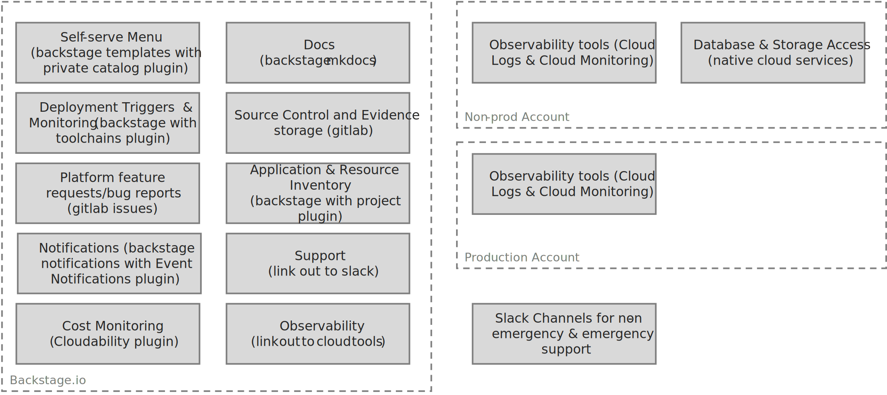{: caption="Backstage.io application developer experience" caption-side="bottom"}

**Backstage.io** serves as the front end for the entire developer experience, streamlining workflows and improving productivity. However, the implementation of key IDP functions for {{site.data.keyword.cloud_notm}} deployments still rely on IBM Cloud’s native tools. These integrations can coexist with other cloud environments, giving developers flexibility in their deployment choices.

Organizations can customize their stack by replacing components with their preferred tools—such as GitHub instead of GitLab, GitHub Actions instead of {{site.data.keyword.cloud_notm}} toolchains, or Instana Observability instead of {{site.data.keyword.cloud_notm}} observability—ensuring a tailored, scalable, and efficient developer experience.

### Platform engineering operations view
{: #idp-ops-view}

{{site.data.keyword.cloud_notm}} provides platform engineers with an operational view of their platform.

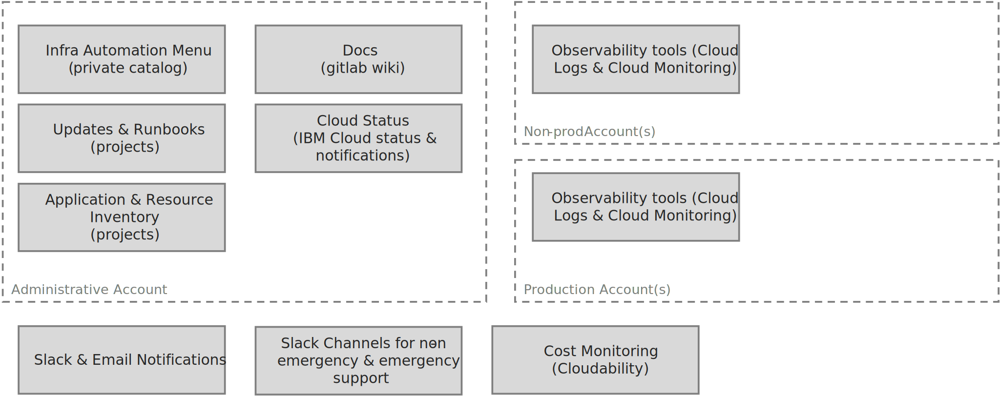{: caption="Platform operations experience" caption-side="bottom"}

Platform engineering teams log in to the {{site.data.keyword.cloud_notm}} administrative account to:

- Browse **deployable architectures** through an IBM Cloud **private catalog**.
- Access application and resource inventories with **IBM Cloud projects**.
- Manage infrastructure and invoke automated runbooks with **IBM Cloud projects**
- Observe applications across environments with **IBM Cloud observability**.
- Optimize cost and implement chargebacks/showbacks with **IBM Cloudability**

A combination of IAM policies, account settings, and catalog configuration hide unnecessary cloud complexities, keeping the focus on operating the platform.

### Platform Engineering Automation dev view
{: #idp-automation-dev-view}

{{site.data.keyword.cloud_notm}} can also provide platform engineers with a development environment for automation, including **deployable architectures**.

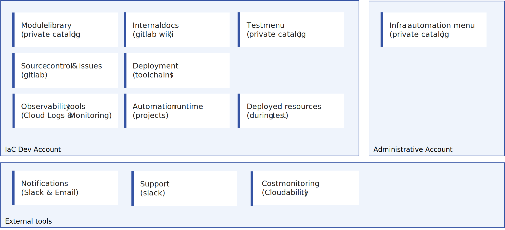{: caption="Platform automation developer experience" caption-side="bottom"}

Automation developers work locally but log in to {{site.data.keyword.cloud_notm}} to:

- Browse automation source code and documentation through **IBM Cloud GitLab**
- Monitor builds and tests with **IBM Cloud toolchains**, **IBM Cloud projects**, and **IBM Cloud observability**.
- Access reusable modules and deployable architectures via the {{site.data.keyword.cloud_notm}} **private catalog**.
- Manage costs and clean up temporary resources with **IBM Cloud projects**
- Publish automation to developer and operations catalogs through **IBM Cloud toolchains**.

### Workload account view
{: #idp-workload-account-view}

While workload accounts are abstracted from application developers, they are critical for platform engineers. We recommend starting with the [IBM Cloud Essential Security and Observability Services](https://cloud.ibm.com/catalog/architecture/deploy-arch-ibm-core-security-svcs-0294f96e-7314-48d1-a710-c08a541b2119-global?catalog_query=aHR0cHM6Ly9jbG91ZC5pYm0uY29tL2NhdGFsb2cjZGVwbG95YWJsZV9hcmNoaXRlY3R1cmVfdGFi) deployable architecture, which enforces best practices for security and observability.

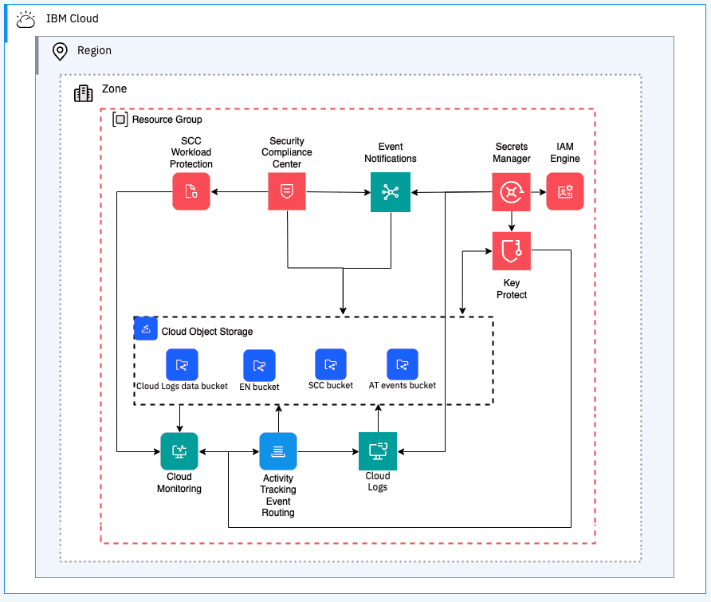{: caption="IBM Cloud Essential Security and Observability Services" caption-side="bottom"}

Solutions vary by organization, but for containerized applications, Red Hat OpenShift is a strong option.

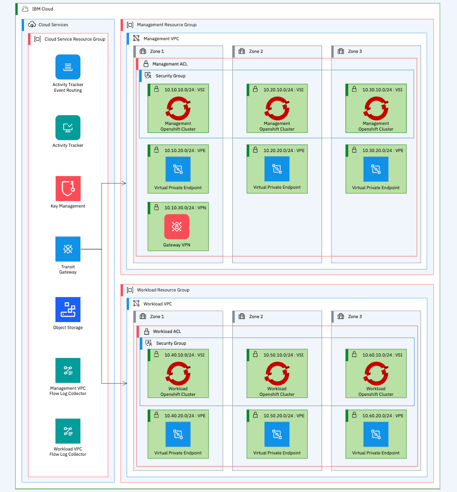{: caption="Red Hat OpenShift Container Platform on VPC landing zone" caption-side="bottom"}

The [Red Hat OpenShift Container Platform on VPC Landing Zone](https://cloud.ibm.com/catalog/architecture/deploy-arch-ibm-slz-ocp-95fccffc-ae3b-42df-b6d9-80be5914d852-global?catalog_query=aHR0cHM6Ly9jbG91ZC5pYm0uY29tL2NhdGFsb2cjZGVwbG95YWJsZV9hcmNoaXRlY3R1cmVfdGFi) deployable architecture establishes a scalable foundation for hosting container-based workloads. It configures VPCs, subnets, worker pools, secure ingress, key management, and object storage for secure backups.

## Summary of {{site.data.keyword.cloud_notm}} guidance for platform engineers
{: #summary}

In response to the cost and complexities of modern infrastructure management, platform engineering is emerging as a strategic approach favored by development organizations. {{site.data.keyword.cloud}} capabilities can be incorporated into the internal developer platform (IDP) developed by the platform engineering team.

### Key {{site.data.keyword.cloud_notm}} best practices for platform engineers
{: #key-bps}

- **Automate infrastructure and operations:** Use **Terraform** and **Ansible** to define infrastructure, onboarding, and Day 2 operations. Leverage {{site.data.keyword.cloud_notm}}'s library of terraform modules and **deployable architectures**.  Package custom automation as deployable architectures for reuse.
- **Implement secure CI/CD pipelines:** Use or extend the **DevSecOps Application Lifecycle Management** deployable architecture (based on {{site.data.keyword.cloud_notm}} **Continuous Delivery**) to integrate shift-left security checks and automate CC/CI and CD processes.
- **Enable self-service automation:** Offer automation through the **IBM Cloud catalog**, ensuring easy access for development teams.
- **Enforce secure access controls:** Apply least-privilege principles for users by using **Trusted Profiles** for temporary privilege escalation.
- **Streamline compliance management:** Audit custom **deployable architectures** and log compliance in the **IBM Cloud catalog**, and use **Security and Compliance Center** to automate compliance checks.
- **Maintain deployment integrity:** Use **IBM Cloud projects** to detect drift, ensure compliance, and keep deployments up to date.
- **Optimize account segmentation:** Separate administration, production, and nonproduction workloads with **enterprise accounts** for better governance.
- **Ensure high availability and disaster recovery:** Leverage built-in **high availability** and **business continuity and disaster recovery** capabilities instead of custom solutions on {{site.data.keyword.cloud_notm}}.
- **Manage costs effectively:** Use IBM **Cloudability** for cost monitoring, charge-backs, and show-backs. Take advantage of **enterprise savings plans**, **reservations**, and **Subscriptions** for discounts.
- **Enhance observability and event management:** Monitor infrastructure with **Cloud Monitoring** and **Cloud Logs**. Provide developers with access during onboarding. Integrate monitoring with **Event Notifications** to route key alerts to the right teams.

By following these best practices, platform engineers can reduce operational overhead, enhance security and compliance, and empower application teams to operate efficiently in complex environments.
